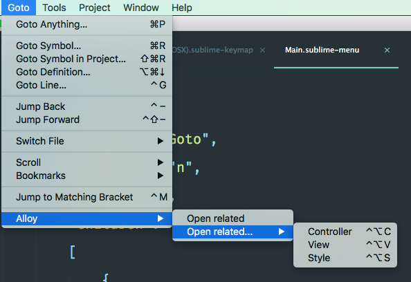

[](LICENSE)
[](https://packagecontrol.io/packages/Titanium%20Alloy%20Related)

# Axway Titanium Alloy Related Plugin for Sublime Text 3

This is a Sublime Text 3 plugin to easily navigate around your Axway Titanium Alloy application source code.

Original idea comes from an [Atom Package](https://github.com/chrisgedrim/ti-alloy-related-plus).

## Installation

The best way to install is to use [Package Control](http://wbond.net/sublime_packages/package_control) for Sublime Text. Search for "Titanium Alloy Related" as the package name.

## Features & Usage

This plugin allows you to easily and quickly navigate throw the related Alloy files for a given Controller, View or Style file.

You need to have at least one of the files opened (Controller, Style or View file) in order to be able to use this plugin.

By using the key bindings, you can navigate through the associated controller, style or view files.

By using the main menu entry you'll be able to do the same or open all the related files at once.

## Sublime Text Main Menu Entries

* `Goto > Alloy > Open related`
* `Goto > Alloy > Open related... > Controller`
* `Goto > Alloy > Open related... > Style`
* `Goto > Alloy > Open related... > View`

[]()

## Sublime Text Key Bindings

* `ctrl + alt + c`: open the related Controller file.
* `ctrl + alt + s`: open the related Style file.
* `ctrl + alt + v`: open the related View file.

## Credits

* [Atom Package](https://github.com/chrisgedrim/ti-alloy-related-plus) for the original idea.
* [Chain of Command](https://github.com/jisaacks/ChainOfCommand) Sublime Text plugin in order to open multiple files at once.

## License

```
MIT License

Copyright (c) 2017 Cyber-Duck

Permission is hereby granted, free of charge, to any person obtaining a copy
of this software and associated documentation files (the "Software"), to deal
in the Software without restriction, including without limitation the rights
to use, copy, modify, merge, publish, distribute, sublicense, and/or sell
copies of the Software, and to permit persons to whom the Software is
furnished to do so, subject to the following conditions:

The above copyright notice and this permission notice shall be included in all
copies or substantial portions of the Software.

THE SOFTWARE IS PROVIDED "AS IS", WITHOUT WARRANTY OF ANY KIND, EXPRESS OR
IMPLIED, INCLUDING BUT NOT LIMITED TO THE WARRANTIES OF MERCHANTABILITY,
FITNESS FOR A PARTICULAR PURPOSE AND NONINFRINGEMENT. IN NO EVENT SHALL THE
AUTHORS OR COPYRIGHT HOLDERS BE LIABLE FOR ANY CLAIM, DAMAGES OR OTHER
LIABILITY, WHETHER IN AN ACTION OF CONTRACT, TORT OR OTHERWISE, ARISING FROM,
OUT OF OR IN CONNECTION WITH THE SOFTWARE OR THE USE OR OTHER DEALINGS IN THE
SOFTWARE.
```
